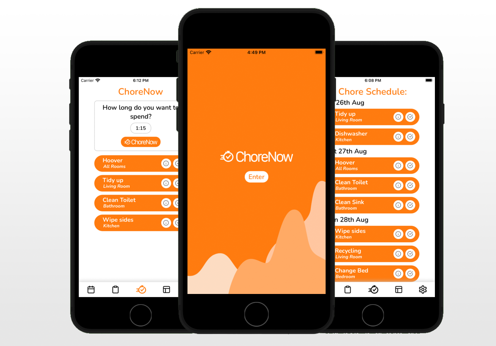

<p align='center'>

</p>

<p align='center'>
ChoreNow is a mobile app for tracking chores. It uses an algorithm to help you prioritise your chores.
</p>

## Screenshots

<p align='center'>

</p>

## Features

- View a prioritised list of chores you should complete for the coming 7 days, based on your preferences for how long you would like to spend doing chores each day.
- Want to find out chores to do right now? Tell it how long you want to spend and it will return the top priority chores.
- View all chores by due status.
- Record all your chores in one place.
- Update your preferences for how long you want to spend doing chores each day of the week.

## Getting started

You will require the following to be able to run the ChoreNow repo:

- [Expo](https://docs.expo.dev/get-started/installation/)
- A mobile device or emulator with expo set up on it
- [MongoDB](https://www.mongodb.com/)
- [ngrok](https://dashboard.ngrok.com/get-started/setup)

## Installation

1. Clone this repo and enter!

```bash
git clone https://github.com/fcaud/choreNow.git
cd waggle
```

2. Install all dependencies

```bash
cd client                 # ! Change into the client folder !
npm install
```

```bash
  cd ../server              # ! Change into the server folder !
  npm install
```

3. Start ngrok on port 3000 and update NGROK_URL in './client/Utils/NgrokUrl.js' to be the https url provide by ngrok
4. Run the server

```bash
cd server                 # ! New terminal and change into the server folder !
npm run dev
```

5. Run the client

```bash
cd client                # ! New terminal and change into the server folder !
expo start
```

## Technology Used

- [React Native](https://reactnative.dev/)
- [NodeJs](https://nodejs.org/en/)
- [Express.js](https://expressjs.com/)
- [MongoDB](https://www.mongodb.com/)
- [Mongoose](https://mongoosejs.com/)
- [Lottie](https://lottiefiles.com/)
